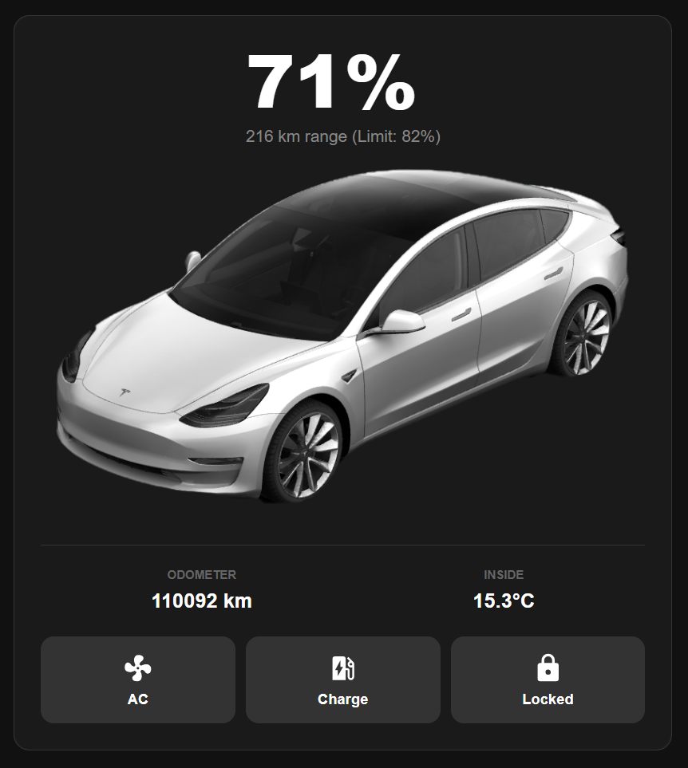

# Tesla Card for Home Assistant

A sleek, custom card designed for the Tesla Fleet API. This card provides a professional interface to monitor and control your Tesla directly from your dashboard.




## Features
* Vehicle Controls: Toggle car conditioning (AC), lock or unlock the doors, and start or stop charging.
* Live Status: Real-time display of battery percentage, remaining range, and odometer.
* Climate Monitoring: Shows the current inside temperature of the vehicle.
* Dynamic Visuals: Central image updates automatically based on the car's state (charging, heating, cooling, or off).

---

## Installation

### Installation via HACS (Recommended)
1. Add this repository to HACS as a **Lovelace** custom repository.
2. Click **Install**.
3. HACS will automatically manage and register `/hacsfiles/tesla-card/tesla-card.js` as a dashboard resource.

### Manual Installation
1. Download `tesla-card.js` along with the `images/` directory from the release.
2. Place the extracted files inside your Home Assistant configuration directory under `/config/www/community/tesla-card/`:
   * `/config/www/community/tesla-card/tesla-card.js`
   * `/config/www/community/tesla-card/images/`
3. In Home Assistant, navigate to **Settings > Dashboards > 3 dots (top right) > Resources**.
4. Add a new resource:
   * **URL:** `/hacsfiles/tesla-card/tesla-card.js` (or `/local/community/tesla-card/tesla-card.js` if not using HACS)
   * **Resource Type:** JavaScript Module

---

## Privacy and Prefix Configuration
To protect your privacy and keep sensitive data like license plates or VINs out of your configuration, this card uses a prefix system.

### How to find your Prefix
The prefix is the unique identifier Home Assistant uses for your vehicle entities.
1. Go to Settings > Devices and Services > Tesla.
2. Click on Entities.
3. Look for your Battery Level sensor (example: sensor.mycar_battery_level).
4. The prefix is the text between "sensor." and the next underscore.
   * Example: If your entity is sensor.abc_123_battery_level, your prefix is: abc_123

### Dashboard Setup
Add a Custom Manual Card to your dashboard and enter the following YAML:

```yaml
type: custom:tesla-car-card
prefix: [YOUR_PREFIX_HERE]
